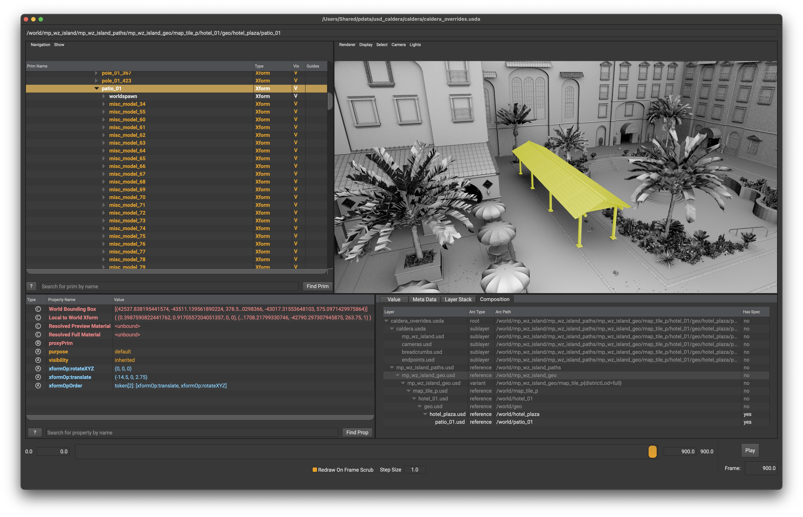
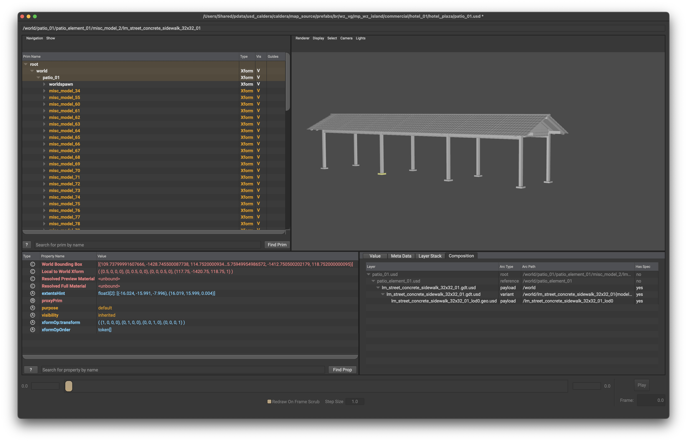
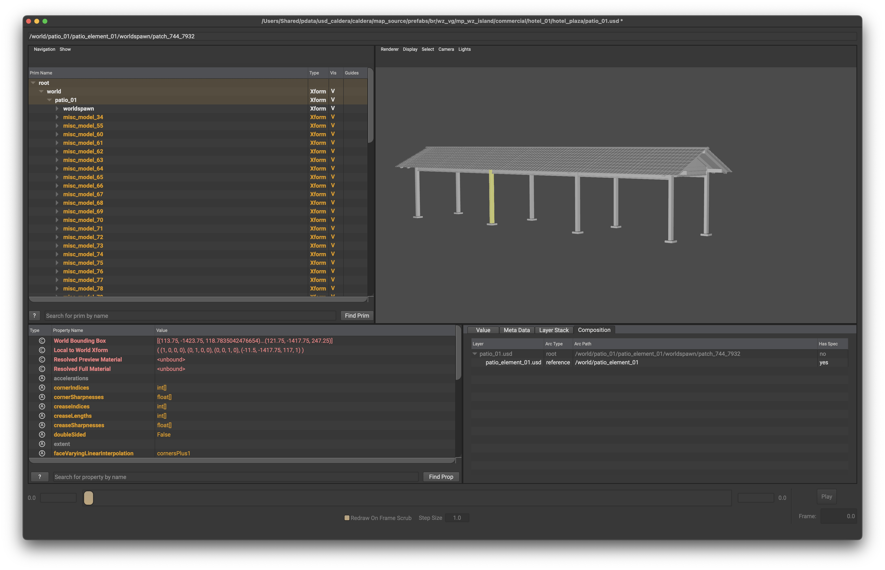
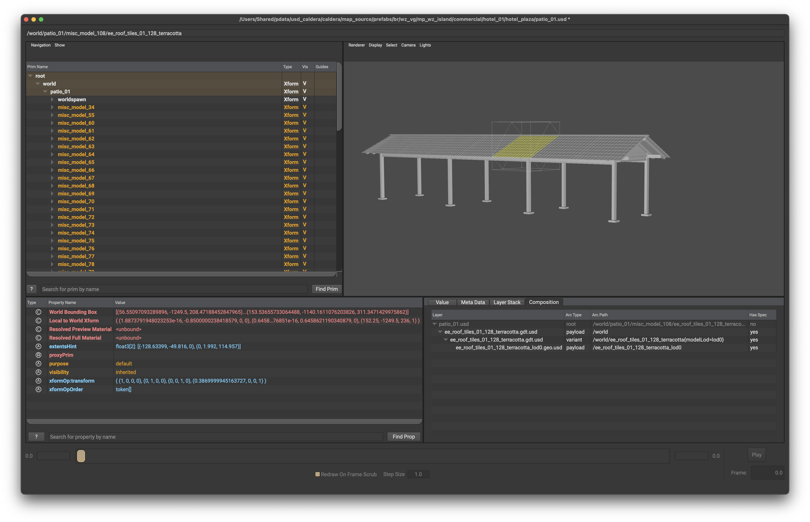
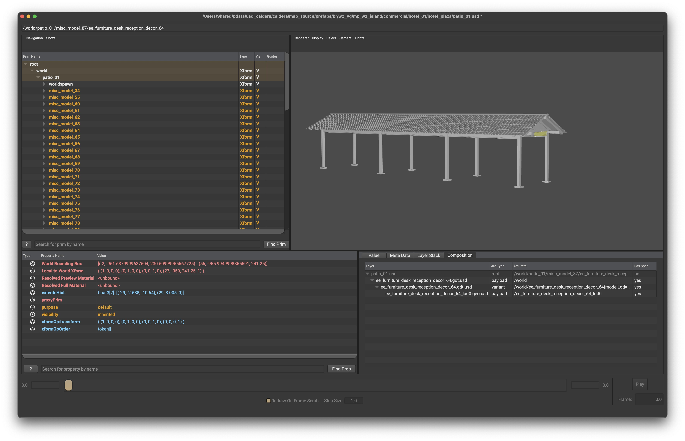
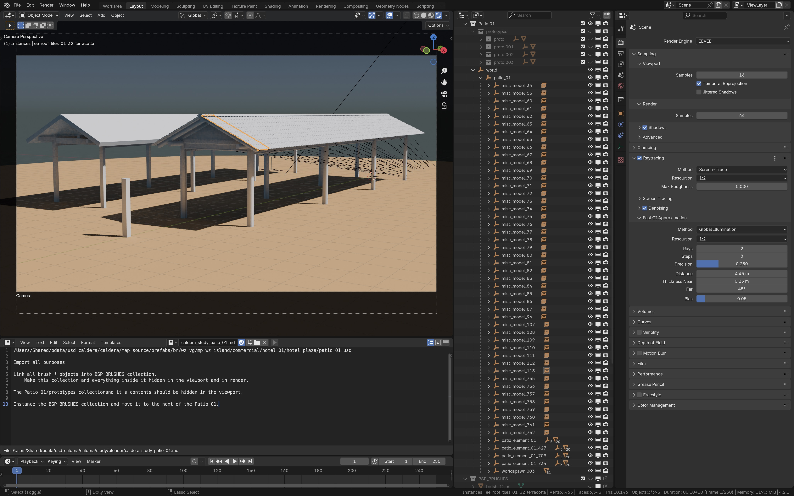

Let's take a closer look at the patio_01 asset.

Launch the patio_01 in usdview

As you can see, patio_01 is composed of many other usd files.

Import patio_01 with guide/proxy/render display purposes.

